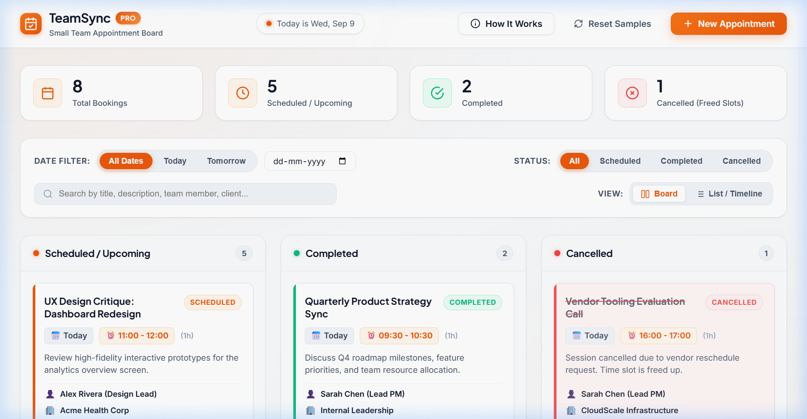
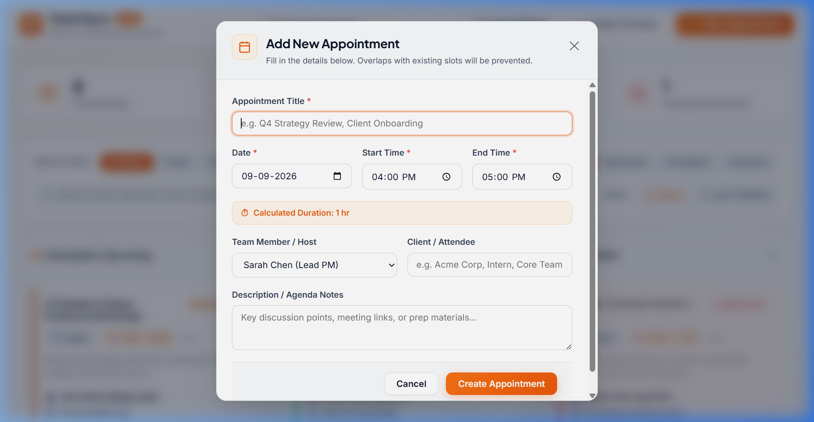
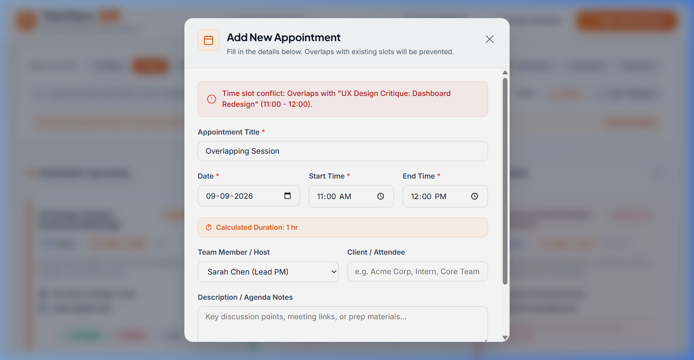
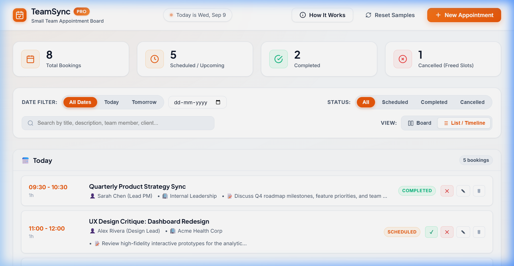

# TeamSync — Small Team Appointment Board

An interactive, responsive full-stack web application built for small teams to effortlessly schedule, track, update, complete, and cancel appointments with zero double-booking or slot conflicts. Designed with a clean, modern **White and Orange** aesthetic.

---

## 1. The Essentials (Must-Haves)

### Project Title
**TeamSync — Small Team Appointment Board**

### Description
Managing appointment schedules in small teams (such as consulting practices, design agencies, medical clinics, or engineering pods) often leads to double-booking, missed updates, and confusion over cancelled slots. **TeamSync** solves this problem by providing a centralized, real-time appointment board with an automated **Slot Conflict Prevention Engine**. It ensures that no two appointments can collide within the same time window on any given date, while keeping cancelled slots auditable and immediately re-bookable.

**Technologies & Languages Used:**
- **Backend**: Node.js, Express.js (RESTful API architecture)
- **Data Persistence**: File-persisted JSON Database (`server/data/appointments.json`) with atomic read/write operations — no external database setup required
- **Frontend**: HTML5, Vanilla JavaScript (ES6+ reactive state management, asynchronous Fetch API), and Vanilla CSS3 (custom design system, Plus Jakarta Sans & Inter typography, responsive CSS Grid and Flexbox layouts)
- **Testing**: Node.js built-in `assert` test runner for interval mathematics and API validation

### Installation Instructions
Follow these step-by-step instructions to get TeamSync running on your local machine:

1. **Clone or Download the Repository:**
   ```bash
   cd "Full Stack Intern"
   ```

2. **Verify Node.js Version:**
   Make sure you have Node.js (v18.0.0 or higher) installed:
   ```bash
   node -v
   npm -v
   ```

3. **Install Dependencies:**
   Install the required server dependencies (`express`, `cors`):
   ```bash
   npm install
   ```

---

## 2. Usage & Setup (How to Use It)

### How to Run the Project
Start the application server with:
```bash
npm start
```
For auto-reloading during development:
```bash
npm run dev
```

Once started, open your web browser and navigate to:
👉 **`http://localhost:3000`**

To execute the automated unit and conflict validation test suite:
```bash
npm test
```

### Environment Variables
TeamSync runs with sensible zero-config defaults out of the box. You can optionally set the following environment variables in a `.env` file or export them in your terminal:

| Variable | Type | Default Value | Description |
| :--- | :--- | :--- | :--- |
| `PORT` | Number | `3000` | The network port the HTTP server listens on |
| `NODE_ENV` | String | `development` | Runtime environment mode (`development` or `production`) |

*(Note: TeamSync does not require external third-party API keys or secret tokens to run.)*

### Visual Previews & Screenshots

#### 1. Main Kanban Board View (White & Orange Theme)
*View appointments organized across three interactive swimlanes: Scheduled, Completed, and Cancelled.*


#### 2. Add / Edit Appointment Modal
*Quick booking modal with automatic duration calculations and slot validation.*


#### 3. Real-Time Slot Conflict Prevention Engine
*Attempting to book an overlapping time slot is instantly flagged and blocked with the conflicting meeting details.*


#### 4. Chronological Timeline List View
*Alternative day-by-day chronological view grouped by date.*


---

## 3. Project Management & Structure

### Key Features
- 📋 **Dual Views (Kanban & Timeline)**: Switch seamlessly between a 3-lane Kanban board (*Scheduled*, *Completed*, *Cancelled*) and a chronological day-by-day timeline view.
- 🛡️ **Double-Booking Guard**: Mathematical interval collision algorithm `(startA < endB) && (endA > startB)` prevents overlapping appointments on the same date.
- ⏱️ **Adjacent Slots Permitted**: Consecutive meetings (e.g., `09:00 - 10:00` and `10:00 - 11:00`) are recognized as non-overlapping and permitted.
- 🔄 **Safe Editing**: Editing title, description, or attendee details on an existing booking excludes the appointment's own slot from false self-conflict alarms.
- 🚫 **Audit-Friendly Cancellations**: Cancelled appointments remain visible in the *Cancelled* lane for full auditing, but their time slots are automatically freed up for rebooking.
- 🔍 **Real-Time Filtering & Search**: Instant filter chips for *Today*, *Tomorrow*, *All Dates*, custom calendar date picker, status filters, and live search across title, description, host, and client.
- 📊 **Live Metric Summary**: Top summary cards reflect real-time counts for Total, Scheduled, Completed, and Cancelled bookings.
- 🔔 **Instant Feedback**: Toast notifications and inline error banners guide user actions clearly.
- 💾 **Pre-Seeded Sample Data**: Automatically populated with realistic team appointments for immediate review, with a "Reset Samples" button for instant testing.

### Project Structure
```text
Full Stack Intern/
├── docs/
│   └── screenshots/               # High-resolution UI screenshots for documentation
│       ├── add_appointment_modal.png
│       ├── board_view.png
│       ├── conflict_prevention.png
│       └── timeline_view.png
├── public/                        # Client-Side Frontend
│   ├── css/
│   │   └── style.css              # Custom White & Orange CSS design system
│   ├── js/
│   │   ├── api.js                 # Frontend REST API client
│   │   └── app.js                 # UI controller, state management & reactive views
│   └── index.html                 # Semantic Single Page Application HTML
├── server/                        # Server-Side Backend
│   ├── data/                      # Persistent storage directory
│   │   └── appointments.json      # File-persisted JSON database
│   ├── src/
│   │   ├── routes/
│   │   │   └── appointments.js    # RESTful API endpoints & request handlers
│   │   ├── app.js                 # Express app configuration & middleware
│   │   ├── db.js                  # Persistent storage engine & sample seed generator
│   │   └── validator.js           # Slot conflict detection & validation algorithms
│   ├── server.js                  # Application entry point (listens on PORT)
│   └── test_conflicts.js          # Automated conflict & validation test suite
├── package.json                   # Project metadata, scripts, and dependencies
└── README.md                      # Comprehensive project documentation
```

### REST API Reference

| Method | Endpoint | Description | Query / Body Parameters |
| :--- | :--- | :--- | :--- |
| `GET` | `/api/appointments` | Fetch appointments with optional filters | Query: `?date=YYYY-MM-DD&status=all\|scheduled\|completed\|cancelled&search=...` |
| `GET` | `/api/appointments/:id` | Fetch a single appointment by ID | URL parameter: `id` |
| `POST` | `/api/appointments` | Create new appointment (validates slot conflict) | Body: `{ title, date, start_time, end_time, assignee, client, description }` |
| `PUT` | `/api/appointments/:id` | Update an existing appointment | Body: `{ title, date, start_time, end_time, assignee, client, description, status }` |
| `PATCH` | `/api/appointments/:id/status` | Update status (`scheduled`, `completed`, `cancelled`) | Body: `{ status: "scheduled" \| "completed" \| "cancelled" }` |
| `DELETE` | `/api/appointments/:id` | Permanently delete appointment record | URL parameter: `id` |
| `POST` | `/api/appointments/reset-samples` | Reset storage back to sample demo data | None |

---

## 4. Housekeeping & Credits

### Contributing Guidelines
Contributions are welcome! If you would like to help enhance TeamSync:
1. **Fork the Repository** and create a feature branch (`git checkout -b feature/amazing-feature`).
2. **Make your changes** adhering to clean code standards and vanilla CSS/JS architecture.
3. **Run the test suite** to ensure no conflict regressions:
   ```bash
   npm test
   ```
4. **Commit your changes** with clear, descriptive commit messages (`git commit -m 'Add recurring appointment support'`).
5. **Push to the branch** (`git push origin feature/amazing-feature`) and open a Pull Request.

If you encounter any bugs or have feature suggestions, please feel free to submit an issue with reproduction steps.

### Credits / Authors
- **Author**: Full Stack Developer Intern candidate
- **Practical Task**: Appointment Board for Small Team
- **Built with**: Node.js, Express, JavaScript, HTML5, CSS3, Plus Jakarta Sans & Inter fonts by Google Fonts.

### License
This project is open-source software licensed under the **[MIT License](https://opensource.org/licenses/MIT)**. You are free to use, modify, and distribute this software for personal or commercial purposes.
