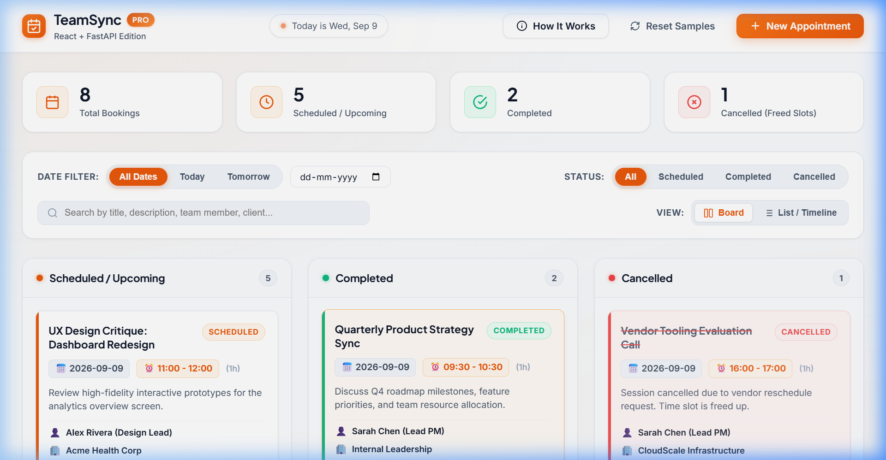

# TeamSync — Small Team Appointment Board

An interactive, responsive full-stack web application built for small teams to effortlessly schedule, track, update, complete, and cancel appointments with zero double-booking or slot conflicts. Designed with a clean, modern **White and Orange** aesthetic.

This repository features **two complete full-stack implementations**:
1. **React + Python (FastAPI) Stack**: Modern component-based React SPA powered by Vite + high-performance FastAPI asynchronous REST API with SQLAlchemy ORM (SQLite / PostgreSQL-ready).
2. **Node.js (Express) Stack**: Lightweight Express REST API + reactive Vanilla JavaScript SPA with persistent JSON storage.

---

## 1. The Essentials (Must-Haves)

### Project Title
**TeamSync — Small Team Appointment Board**

### Description
Managing appointment schedules in small teams (such as consulting practices, design agencies, medical clinics, or engineering pods) often leads to double-booking, missed updates, and confusion over cancelled slots. **TeamSync** solves this problem by providing a centralized, real-time appointment board with an automated **Slot Conflict Prevention Engine**. It ensures that no two appointments can collide within the same time window on any given date, while keeping cancelled slots auditable and immediately re-bookable.

**Technologies & Languages Used:**
- **Frontend**: **React** (Vite, Hooks, Component-driven architecture) & **HTML5/Vanilla JS/CSS3** (custom design system, Plus Jakarta Sans & Inter typography, responsive CSS Grid and Flexbox layouts).
- **Backend**: **Python (FastAPI)** with **Pydantic v2** validation and **Node.js (Express.js)**.
- **Databases & ORM**: **SQLAlchemy** with **SQLite** (zero-setup default, instantly switchable to **PostgreSQL** or **MySQL** via `DATABASE_URL`) and file-persisted JSON database.
- **Testing**: Python `unittest` suite (`test_api.py`) & Node.js `assert` test runner (`test_conflicts.js`).

---

## 2. Usage & Setup (How to Use It)

### Option A: Running the React + Python (FastAPI) Stack (Recommended)

#### 1. Start the FastAPI Backend
```bash
# Navigate to backend directory
cd backend_fastapi

# Install dependencies
pip install -r requirements.txt

# Run automated tests
python test_api.py

# Start the server
python run.py
```
- **Backend API**: 👉 `http://localhost:8000`
- **Interactive Swagger API Docs**: 👉 `http://localhost:8000/docs`

#### 2. Start the React Frontend
```bash
# In a new terminal, navigate to the React frontend directory
cd frontend_react

# Install dependencies
npm install

# Start development server
npm run dev
```
- **React Frontend**: 👉 `http://localhost:5173`

---

### Option B: Running the Node.js + Express Stack

```bash
# From repository root
npm install

# Run automated tests
npm test

# Start the server
npm start
```
- **Node.js Web App**: 👉 `http://localhost:3000`

---

### Environment Variables

| Variable | Stack | Default Value | Description |
| :--- | :--- | :--- | :--- |
| `DATABASE_URL` | FastAPI | `sqlite:///./appointments.db` | Database connection string (SQLite, PostgreSQL, or MySQL) |
| `PORT` | Node.js | `3000` | HTTP port for Node.js Express server |
| `NODE_ENV` | Both | `development` | Runtime environment mode |

*(Note: TeamSync requires zero external third-party API keys or cloud tokens to run out of the box.)*

---

### Visual Previews & Screenshots

#### 1. React + FastAPI Edition Board (White & Orange Theme)
*Interactive Kanban board with Scheduled, Completed, and Cancelled swimlanes connected to FastAPI.*


#### 2. Main Board View Overview
*Clean card layout with time badges, duration calculation, and real-time statistics.*


#### 3. Add / Edit Appointment Modal
*Quick booking modal with automatic duration calculations and slot validation.*


#### 4. Real-Time Slot Conflict Prevention Engine
*Attempting to book an overlapping time slot is instantly flagged and blocked with the conflicting meeting details.*


#### 5. Chronological Timeline List View
*Alternative day-by-day chronological view grouped by date.*


---

## 3. Project Management & Structure

### Key Features
- 📋 **Dual Views (Kanban & Timeline)**: Switch seamlessly between a 3-lane Kanban board (*Scheduled*, *Completed*, *Cancelled*) and a chronological day-by-day timeline view.
- 🛡️ **Double-Booking Guard**: Mathematical interval collision algorithm `(startA < endB) && (endA > startB)` prevents overlapping appointments on the same date.
- ⏱️ **Adjacent Slots Permitted**: Consecutive meetings (e.g., `09:00 - 10:00` and `10:00 - 11:00`) are recognized as non-overlapping and permitted.
- 🔄 **Safe Editing**: Editing title, description, or attendee details on an existing booking excludes the appointment's own slot from false self-conflict alarms.
- 🚫 **Audit-Friendly Cancellations**: Cancelled appointments remain visible in the *Cancelled* lane for full auditing, but their time slots are automatically freed up for rebooking.
- 🔍 **Real-Time Filtering & Search**: Instant filter chips for *Today*, *Tomorrow*, *All Dates*, custom calendar date picker, status filters, and live search across title, description, host, and client.
- 📊 **Live Metric Summary**: Top summary cards reflect real-time counts for Total, Scheduled, Completed, and Cancelled bookings.
- 🔔 **Instant Feedback**: Toast notifications and inline error banners guide user actions clearly.
- 💾 **Pre-Seeded Sample Data**: Automatically populated with realistic team appointments for immediate review, with a "Reset Samples" button for instant testing.

### Project Structure
```text
Full Stack Intern/
├── backend_fastapi/               # Python (FastAPI) Backend
│   ├── app/
│   │   ├── __init__.py
│   │   ├── crud.py                # Conflict detection engine & database CRUD
│   │   ├── database.py            # SQLAlchemy session (SQLite / PostgreSQL)
│   │   ├── main.py                # FastAPI app, routes & CORS configuration
│   │   ├── models.py              # SQLAlchemy Appointment ORM model
│   │   ├── schemas.py             # Pydantic v2 validation models
│   │   └── seed.py                # Sample appointment data generator
│   ├── requirements.txt           # Python dependencies (fastapi, uvicorn, sqlalchemy)
│   ├── run.py                     # Entry runner script
│   └── test_api.py                # Automated backend test suite
├── frontend_react/                # React Frontend (Vite)
│   ├── src/
│   │   ├── components/
│   │   │   ├── AboutModal.jsx     # "How It Works" info modal
│   │   │   ├── AppointmentCard.jsx# Interactive appointment card
│   │   │   ├── AppointmentModal.jsx# Add/Edit modal with conflict prevention
│   │   │   ├── FilterToolbar.jsx  # Date & status filtering controls
│   │   │   ├── Header.jsx         # App header & branding
│   │   │   ├── KanbanBoard.jsx    # 3-column Kanban board
│   │   │   ├── StatsBar.jsx       # Real-time metrics overview
│   │   │   ├── TimelineView.jsx   # Chronological schedule view
│   │   │   └── ToastContainer.jsx # Real-time notification alerts
│   │   ├── services/
│   │   │   └── api.js             # REST API service client
│   │   ├── App.jsx                # Root application controller
│   │   ├── index.css              # Custom White & Orange design system
│   │   └── main.jsx               # React entry point
│   ├── package.json
│   └── vite.config.js             # Vite config with API proxy
├── docs/
│   └── screenshots/               # High-resolution UI screenshots
│       ├── add_appointment_modal.png
│       ├── board_view.png
│       ├── conflict_prevention.png
│       ├── react_fastapi_board.png
│       └── timeline_view.png
├── public/                        # Node.js Vanilla Frontend
│   ├── css/style.css
│   ├── js/api.js
│   ├── js/app.js
│   └── index.html
├── server/                        # Node.js (Express) Backend
│   ├── data/appointments.json
│   ├── src/app.js
│   ├── src/db.js
│   ├── src/routes/appointments.js
│   ├── src/validator.js
│   ├── server.js
│   └── test_conflicts.js
├── package.json
├── WALKTHROUGH.md                 # Detailed walkthrough & verification document
└── README.md                      # Comprehensive project documentation
```

### REST API Reference (FastAPI & Express)

| Method | Endpoint | Description | Query / Body Parameters |
| :--- | :--- | :--- | :--- |
| `GET` | `/api/appointments` | Fetch appointments with optional filters | Query: `?date=YYYY-MM-DD&status=all\|scheduled\|completed\|cancelled&search=...` |
| `GET` | `/api/appointments/:id` | Fetch a single appointment by ID | URL parameter: `id` |
| `POST` | `/api/appointments` | Create new appointment (validates slot conflict) | Body: `{ title, date, start_time, end_time, assignee, client, description }` |
| `PUT` | `/api/appointments/:id` | Update an existing appointment | Body: `{ title, date, start_time, end_time, assignee, client, description, status }` |
| `PATCH` | `/api/appointments/:id/status` | Update status (`scheduled`, `completed`, `cancelled`) | Body: `{ status: "scheduled" \| "completed" \| "cancelled" }` |
| `DELETE` | `/api/appointments/:id` | Permanently delete appointment record | URL parameter: `id` |
| `POST` | `/api/appointments/reset-samples` | Reset storage back to sample demo data | None |

---

## 4. Housekeeping & Credits

### Contributing Guidelines
Contributions are welcome! If you would like to help enhance TeamSync:
1. **Fork the Repository** and create a feature branch (`git checkout -b feature/amazing-feature`).
2. **Make your changes** adhering to clean code standards and vanilla/React/FastAPI architecture.
3. **Run the test suites** to ensure zero regressions:
   ```bash
   # Test Python backend
   python backend_fastapi/test_api.py

   # Test Node backend
   npm test
   ```
4. **Commit your changes** with clear, descriptive commit messages (`git commit -m 'Add recurring appointment support'`).
5. **Push to the branch** (`git push origin feature/amazing-feature`) and open a Pull Request.

### Credits / Authors
- **Author**: **Batchu Mamatha** ([@BatchuMamatha](https://github.com/BatchuMamatha))
- **Email**: [Batchumamatha631@gmail.com](mailto:Batchumamatha631@gmail.com)
- **Role**: Full Stack Developer
- **Project**: TeamSync — Small Team Appointment Board

### License
This project is open-source software licensed under the **[MIT License](https://opensource.org/licenses/MIT)**. You are free to use, modify, and distribute this software for personal or commercial purposes.
